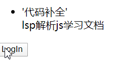
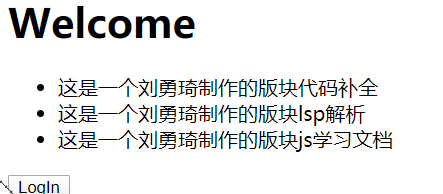
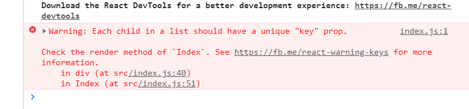
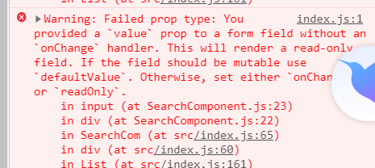
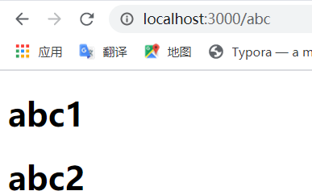
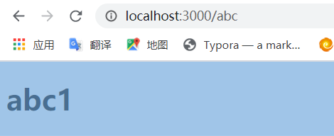
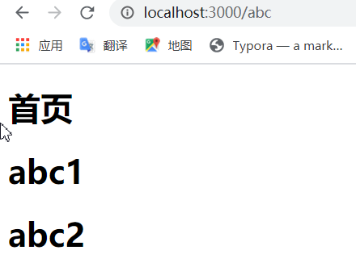

# HTML

# CSS 

## 基础操作

### 居中与垂直居中：

**行内或类行内元素：**

text-align:center

**块级元素：**

margin :auto

**通用方法：父元素操作**

display:flex justify-content:center


# JS

## JS模块化

### commonjs

:Node.js是commonJS规范的主要实践者，它有四个重要的环境变量为模块化的实现提供支持：**module、exports、require、global**。实际使用时，用module.exports定义当前模块对外输出的接口（不推荐直接用exports），用require加载模块。

### AMD&require.js

AMD规范采用异步方式加载模块，模块的加载不影响它后面语句的运行。所有依赖这个模块的语句，都定义在一个回调函数中，等到加载完成之后，这个回调函数才会运行。这里介绍用require.js实现AMD规范的模块化：**用require.config()指定引用路径等，用define()定义模块，用require()加载模块**。
　　首先我们需要引入require.js文件和一个入口文件main.js。main.js中配置require.config()并规定项目中用到的基础模块。

```javascript
script src="js/require.js" data-main="js/main"></script>
 
/** main.js 入口文件/主模块 **/
//首先用config()指定各模块路径和引用名
require.config({
    baseUrl: "js/lib",
    paths: {
        "jquery": "jquery.min",  //实际路径为js/lib/jquery.min.js
        "underscore": "underscore.min",
    }
});
//执行基本操作
require(["jquery","underscore"],function($,_){
    // some code here
});
```

### CMD 

CMD是另一种js模块化方案，它与AMD很类似，不同点在于：AMD 推崇依赖前置、提前执行，CMD推崇依赖就近、延迟执行。此规范其实是在sea.js推广过程中产生的。

```javascript
/** AMD写法 **/
define(["a", "b", "c", "d", "e", "f"], function(a, b, c, d, e, f) {
     // 等于在最前面声明并初始化了要用到的所有模块
    a.doSomething();
    if (false) {
        // 即便没用到某个模块 b，但 b 还是提前执行了
        b.doSomething()
    }
});
 
/** CMD写法 **/
define(function(require, exports, module) {
    var a = require('./a'); //在需要时申明
    a.doSomething();
    if (false) {
        var b = require('./b');
        b.doSomething();
    }
});
 
/** sea.js **/
// 定义模块 math.js
define(function(require, exports, module) {
    var $ = require('jquery.js');
    var add = function(a,b){
        return a+b;
    }
    exports.add = add;
});
// 加载模块
seajs.use(['math.js'], function(math){
    var sum = math.add(1+2);
});
```


### ES6

```javascript
/** 定义模块 math.js **/
var basicNum = 0;
var add = function (a, b) {
    return a + b;
};
export { basicNum, add };
 
/** 引用模块 **/
import { basicNum, add } from './math';
function test(ele) {
    ele.textContent = add(99 + basicNum);
}

/* export default*/
export default { basicNum, add };
//引入
import math from './math';
function test(ele) {
    ele.textContent = math.add(99 + math.basicNum);
}
```

# NodeJS

# 计算机网络

# React

### style

style 应该是预先写好的 而不是字符串

Error: The `style` prop expects a mapping from style properties to values, not a string. For example, style={{marginRight: spacing + 'em'}} when using JSX.    in h1 (at src/index.js:22)    in div (at src/index.js:21)

```jsx
let classStr = ['abc','redBg'];//abc,redBg
```

正确的做法：使用join拼接:

```jsx
<h1  className={classStr.join(" ")} > Style </h1>//abc redBg
```

添加背景：

```jsx
let exampleStyle = {
  background:"skyblue",
  borderBottom:"1px solid red",
  //由于有-只能圈起来
  'background-image':"url(https://www.baidu.com/s?wd=2020%e5%b9%b4%e5%85%a8%e5%9b%bd%e4%b8%a4%e4%bc%9a&sa=ire_dl_gh_logo&rsv_dl=igh_logo_pc)"
}
//也可以这样并起来
  backgroundImage:"url(https://www.baidu.com/img/pc_cc75653cd975aea6d4ba1f59b3697455.png)",
```

## 基础

### 函数式组件

```jsx
function Childcom(){
  let title = <h2> subTitle </h2>
  return(
      <div>
        <h1> Hello world</h1>
        {title}
      </div>
  )
}


ReactDOM.render(
  <Childcom></Childcom>,
  document.getElementById('root')
);

```

### 状态：(React State)

相当于vue Data

下面老看一个时钟

```jsx
class Clock extends React.Component{
  //
  constructor(props){
    //这样之后才可以用this.props
    super(props);
    //状态(data)--->view

  }
  render(){
    //应该放在渲染函数里面进行渲染
    this.state = {
      time:new Date().toLocaleTimeString()
    }
    // console.log(this.state.time);
    return(
    <div>
      <h1> {this.state.time} </h1>
    </div>
    )
  }
}
```

注意：

```jsx
//如果反复进行一个组件的初始化，他是不会反复重建的
setInterval(()=>{ReactDOM.render(
  <Clock></Clock>,
  document.getElementById('root')
  )
  console.log(new Date())
}
,
1000);
```

### 使用生命周期函数对组件进行操作

```jsx
class Clock extends React.Component{
  //
  constructor(props){
    //这样之后才可以用this.props
    super(props);
    //状态(data)--->view
    this.state = {
      time:new Date().toLocaleTimeString()
    }
  }
  render(){
    //这会导致组件的耦合度很高

    // console.log(this.state.time);
    return(
    <div>
      <h1> {this.state.time} </h1>
    </div>
    )
  }
  //生命周期函数 渲染完成：
  componentDidMount(){
    setInterval(()=>{
      this.state.time = new Date().toLocaleString();
    },1000);
  }
}
```

但是上面的操作是不推荐的，

我们应该使用setState来进行局部的dom更新:

```jsx

  //生命周期函数 渲染完成：
  componentDidMount(){
    setInterval(()=>{
      console.log(this.state.time);
      //修改完之后并不会立即修改dom内容。
      //react会在这个函数内部所有设置的状态
      //等待内部所有完成之后进行更新
      //小程序也是借鉴react状态管理操作
      this.setState({
        time:new Date().toLocaleString()
      })
      console.log(this.state.time);
    },1000);
  }
```

### 父子数据传递

props 可以设置默认值：

HelloMessage.defaultProps = { name : 'yqLiu' msg:'helloworld' }


props可以传递函数，props传递父元素的函数，就可以去修改父元素的状态state,从而达到传递数据给父元素的效果。

#### props机制（父->子)

props的传值可以是任意的类型

注意props和State是两个不同的东西

```jsx
class ChildComponent extends React.Component {
  constructor(props) {
    super(props);
  }
  render() {
    return (
      <div display={this.props.isActive?'block':'None'}> 
        ChildComponent
      </div>
    )
  }
}
```

#### 子传父

调用父元素的函数，从而实现数据的子传递父

```jsx
export default class ChildComponent extends Component {
  constructor(props) {
    super(props)
  
    this.state = {
       msg:'hi father'
    }
  }
  
  render() {
    return (
      <div>
        <button onClick={this.sendData}>传给父元素</button>
      </div>
    )
  }
  //使用箭头函数可以防止循环溢出
  sendData=()=>{
    this.props.getChildMsg(this.state.msg)
  }
}
```

注意不能直接使用传递过来的参数

```jsx
        {/* 注意 直接进行调用可能会导致循环渲染 */}
        <button onClick={this.props.getChildMsg('hello father')}>传给父元素</button>
```

使用箭头函数进行传参

```jsx
        {/* 要使用箭头函数进行传参 */}
        <button onClick={()=>this.props.getChildMsg('hello father')}>传给父元素</button>
```

### React事件

React 事件特点;

- 他绑定属性的命名是使用的驼峰命名法
- 如果采用jsx语法，用{}，传入一个函数，而不是字符串

事件对象：

```jsx
  parentEvent= (e)=>{
    console.log(e);
    //react的代理的原生事件对象
  }
```

普通的html中阻止默认行为 可以直接return false;

React中，必须prevetDefault

```jsx
  parentEvent= (e)=>{
    //react的代理的原生事件对象
    console.log(e.preventDefault);

    //由于是代理 所以不能直接returnfalse 不能拦截
    //使用preventDefault进行拦截
    e.preventDefault();
    return false;
  }
```

如何传参的时候不丢失事件？

```jsx
{/* 这样就变成了一个调用,使用箭头函数 使用e进行传参 */}
<button onClick={(e)=>this.parentEvent1('helloworld',e)}>submit</button>

  parentEvent1= (msg,e)=>{
    //react的代理的原生事件对象
    console.log(msg)
    console.log(e)
  }
```

注意不使用箭头函数会导致this的问题

```jsx
        {/* 不使用箭头函数要使用bind */}
        <button onClick={function(e){this.parentEvent1('helloworld',e)}.bind(this)}>submit</button>
```

### React条件渲染

- 直接通过条件判断返回需要渲染的jsx对象

判断是否登录：

```jsx
function UserGreet(props){
  return (<h1>Welcome</h1>);
}
function UserLogin(props){
  return (<h1>请先登录</h1>)
}

render() {
    if(this.state.isLogin){
      return (<UserGreet/>);
    }else{
      return (<UserLogin/>)
    }
```

注意 函数的引入必须使用component样式，不能直接return UserLogin- 

- 通过条件运算得出jsx对象，再将jsx对象渲染到模板中

```jsx
  render() {
    let ele = null;
    if(this.state.isLogin){
      ele =<UserGreet/>;
    }else{
      ele = <UserLogin/>
    }
    return (
      <div>
        <h1>yqLiu's Home</h1>
        {ele}
        <button onClick={()=>this.setState({isLogin:!this.state.isLogin})}>LogIn</button>
      </div>
    )
  
```

- 同样的，你也可以使用三元运算符：

```jsx
      <div>
        <h1>yqLiu's Home</h1>
        {this.state.isLogin?<UserGreet/>:<UserLogin/>}
        <button onClick={()=>this.setState({isLogin:!this.state.isLogin})}>LogIn</button>
      </div>
```

#### 列表渲染

将列表的内容拼装成数组 放置到模板当中

如果直接使用：

  ```jsx
let arr = ['代码补全','lsp解析','js学习文档'];    
{arr}
  ```

会输出

```jsx
代码补全lsp解析js学习文档
```

如果我们使用html对象

```jsx
let arr = [<li>'代码补全'</li>,'lsp解析','js学习文档'];
```




可以使用map:

```jsx
    {arr.map((e)=>{return <YqLiuComponent childData={e}></YqLiuComponent>})}
```

效果：



- 我们需要为每一个表单一个key属性：
  

```jsx
        <ul>
          { this.state.list.map((e,index)=> {return (
            //加key
            <li key={e.title}>
              <h3> {index}:{e.title}</h3>
              <p>{e.content}</p>
            </li>
          )} ) }
        </ul>
```

得到一个jsx数组 然后放入到模板中。

Key值需要放置到每一项中。

#### 封装为组件

- 注意：使用简单的循环组件会报错：注意key的位置

```jsx
function ListItem(e){
  return (
    <li >
      <h3> {e.index}:{e.data.title}</h3>
      <p>{e.data.content}</p>
  </li>
  )
}  
Index.render() {
    return (
      <div>
        <h1>今日内容</h1>
        <ul>
          { this.state.list.map((e,index)=> {return (
            //key是要加在这里的
            <ListItem key={index} data={e} index={index}></ListItem>
          )} ) }
        </ul>
      </div>
    )
  }
```

### React制作疫情地图

除了数据处理的如下代码

```jsx
export default class List extends Component {
  constructor(props) {
    super(props)
  
    this.state = {
       
    }
  }
  
  render() {
    return (
      <div>
        <h1>China</h1>
        <ul>
          {provinceList.map((e)=>{
            return(
              <section>
                <h3>{`province:${e.province}`}</h3>
                <ul>
                  <li>
                    <span> 确诊 </span>
                    <span> 数量 </span>
                    <span> 疑似 </span>
                    <span> 死亡 </span>
                  </li>
                  <li>
                  {Object.keys(e).map(ele=>{
                    if(ele!='province')
                    return (
                      <span>{`${e[ele]}`}</span>
                    )
                  })}
                  </li>
                </ul>
              </section>

            )
          })}
        </ul>
      </div>
    )
  }
}
```

### React生命周期

声明周期的三个状态：

- Mounting(挂载) 将组件插入到dom对象中
- Updating：将数据更新到DOM中
- Ummounting:将组件移除dom

生命周期是从实例化到渲染到销毁的整个过程就是生命周期

在这个生命周期中有很多我们可以调用的事件

这就叫做

#### 钩子函数

- ComponentWillMount:将要渲染 Ajax 添加动画类
- ComponentDidMount:渲染完毕
- componentWillRecieveProps：组件将要接受props：查看props
- ShouldComponentUpdate:组件接收到新的state和props,判断是否更新，返回布尔值
- ComponentWillUpdate：组件将要更新
- ComponentDidUpdate:组件已经更新
- ComponentWillUnmount:组件将要卸载 保留一些状态或者数据

实例：

```jsx
class Child extends Component {
  constructor(props) {
    super(props)
  
    this.state = {
       msg:'helloworld'
    }
    console.log('constuctor Complete!')
  }
  UNSAFE_componentWillMount(){
    console.log('component will Mount')
  }
  componentDidMount(){
    console.log('component Did Mount')
  }
  UNSAFE_componentWillReceiveProps(){
    console.log("childData:"+this.props.childData);
    console.log('component will get props')
  }
  UNSAFE_componentWillUpdate(){
    console.log("childData:"+this.props.childData);
    console.log('component will update')
  }
  //通过判断来控制组件是否更新
  shouldComponentUpdate(){
    console.log('NotUpdate')
    //判断
    return true;
  }
  componentDidUpdate(){
    console.log("component did update")
  }
  componentWillUnmount(){
    console.log('component Died')
  }
  render() {
    console.log('render Start!')
    return (
      <div>
        {this.state.msg}
        <button onClick = {this.update}> Update </button>
      </div>
    )
  }
  update = ()=>this.setState({
    msg : 'hi the world'
  })
}
```

实现一个拦截更新：

```jsx
update = ()=>this.setState({
    msg : 'hi the world',
    update:false
  })  
shouldComponentUpdate(){
    console.log(`try to update ：Update Capacity${this.state.update}`)
    return this.state.update;
  }
```

### 使用echarts

我们首先要引入echart

```jsx
import echarts from 'echarts';
import 'echarts/map/js/china.js'
```


然后对echart在组件里面初始化，注意这里面应用了OnMount生命周期函数

```jsx
componentDidMount(){
    var myChart = echarts.init(document.getElementById('map'));
    let dataList = [];
    for (let ele of provinceList){
      dataList.push({
        name:ele.province,
        value:ele.value
      })
    }
    function randomValue() {
        return Math.round(Math.random()*1000);
    }
    let option = {
```

#### 写一个search组件

```jsx
export default class SearchCom extends Component {
    constructor(props) {
        super(props)
    
        this.state = {
             
        }
    }
    
    render() {
        return (
            <div>
                <input type="text" placeholder="请输入内容" onKeyDown={this.searchEvent} value=""/>
                <div>
                    <h2> 查询结果 </h2>
                </div>
            </div>
        )
    }
    searchEvent=(e)=>{
        console.log(e)
    }
}
```



我们需要做一些事情来改变value值（change事件)

```jsx
<input type="text" placeholder="请输入内容" onKeyDown={this.searchEvent} value={this.state.value} onChange={this.changeEvent}/> 

searchEvent=(e)=>{
        if(e.keyCode===13){
            console.log(e.target.value);
            let _result = this.props.provinceObj[e.target.value]
            if(!_result){
                this.setState({
                result:<h2>4040NotFound</h2>
                });
            }else{
                this.setState({
                    result:
                    (<div>
                        <h1>{_result.province}</h1>
                        <h3>{_result.value}</h3>
                        <h3>{_result.dead}</h3>
                        <h3>{_result.suspect}</h3>
                    </div>)
                }) 
            }
        }
    }
```

### Ajax+React+Express+axios

服务端：

```js
const express = require('express');
const axios = require('axios');
const app = express();
app.get('/',(req,res)=>{
    res.send('I am a server')
})
app.get('/api/newsdata',async (req,res)=>{
    //请求头条数据
    let result = await axios.get('https://ng.ant.design/ngsw.json?ngsw-cache-bust=0.5633671768572814')
    let data = result.data;
    console.log(`data:${data}`)
    res.json(data)
})
app.listen(8080,()=>{
    console.log('server Start');
    console.log('localhost:8080');
    console.log('/api/newsdata');
}

)
```

## 进阶

### 插槽

语法：

```jsx
{this.props.children}

ReactDOM.render(
  <Parent>
    <h1>title</h1>
    <h1>title</h1>
    <h1>title</h1>
  </Parent>,
  document.getElementById('
    root')
)
```

控制插入的位置

```jsx
<ChildCom>
    <h1 data-position='header'>Header</h1>
    <h1 data-position='main'>Main</h1>
    <h1 data-position='footer'>Footer</h1>
</ChildCom>

export default class ChildCom extends Component {
  render() {
    let headerCom,mainCom,footCom;
    this.props.children.forEach((item,index)=>{
      switch(item.props['data-position']){
        case 'header':headerCom = item; break
        case 'main':mainCom = item; break
        case 'footer':footCom = item; break
      }
    })
    return (
      <div>
        {headerCom}
        {mainCom}
        {footCom}
      </div>
    )
  }
}
```

### 路由

单页面路由

```jsx
import{ BrowserRouter as Router,Link,Route,Redirect} from 'react-router-dom'
export default class Root extends Component {
  render() {
    return (
      <div>
        <Router basename='/admin'>
          <div className="nav">
            <Link to='/'>Home</Link>
            <Link to='/product'>product</Link>
            <Link to='/me'>me</Link>
          </div>
          <Route path='/' exact component={Home}></Route>
          <Route path='/product'  component={Product}></Route>
          <Route path='/me'  component={Me}></Route>
        </Router>
        <Router >
          <div className="nav">
            <Link to='/'>Home</Link>
            <Link to='/product'>product</Link>
            <Link to='/me'>me</Link>
          </div>
          <Route path='/' exact component={Home}></Route>
          <Route path='/product'  component={Product}></Route>
          <Route path='/me'  component={Me}></Route>
        </Router>
      </div>
    )
  }
}
```

Link组件 可以设置to属性to属性可以传递对象:

```jsx
            <Link to={{
              pathname:"/me",
              search:'?username=admin',
              hash:"#abc",
              state:{msg:'hellpworld'}
            }}>me</Link>
```

replace之后不能回退到上一个 例如 a-b-c c back ->a

```jsx
            <Link to='/product' replace>product</Link>
```

#### 动态路由

```jsx
<Link to='/news/456789' replace>News</Link>
<Route path='/news/:id'  component={News}></Route>
function News(props){
  console.log(props);
  return(
    <div>
      <h1>News</h1>
      <h3>News.id:{props.match.params.id}</h3>
    </div>
  )
}
```

#### 重定向(Redirect)

如果访问某个组件时，如果有充电像组件，那么就会修改页面的路

实例：

```jsx
function LoginInfo(props){
  //props.loginState = 'success|fail'
  console.log(props)
  if(props.location.state.loginState == 'success'){
    return <Redirect to='/admin'/>
  }
  return <Redirect to='/login'/>
}
let FormCom=()=>{
  let pathObj = {
    pathname:"/loginInfo",
    state:{
      loginState:'success'
    }
  }
  return (
    <div>
      <h1>Form!!!</h1>
      <Link to={pathObj}>login</Link>
    </div>
  )
}

export default class App extends Component {
  render() {
    return (
      <div>
        <Router>
          <Route path='/' exact component={()=>(<h1>首页</h1>)}></Route>
          <Route path='/login' exact component={()=>(<h1>登录</h1>)}></Route>
          {/* 表单验证 */}
          <Route path='/form' exact component={FormCom}></Route>
          <Route path='/LoginInfo' exact component={LoginInfo}></Route>
        </Router>
      </div>
    )
  }
}
```

#### Switch

加入一个abc对应了两个路由：

```jsx
<Route path='/login' exact component={()=>(<h1>登录</h1>)}></Route>
<Route path='/abc' exact component={()=>(<h1>abc1</h1>)}></Route>
```




switch保证只匹配一个页面

```jsx
<Router>
          <Switch>
            <Route path='/' exact component={()=>(<h1>首页</h1>)}></Route>
            <Route path='/login' exact component={()=>(<h1>登录</h1>)}></Route>
            <Route path='/abc' exact component={()=>(<h1>abc1</h1>)}></Route>
            <Route path='/abc' exact component={()=>(<h1>abc2</h1>)}></Route>
            <Route path='/admin' exact component={()=>(<h1>admin,loginSuccess</h1>)}></Route>
            {/* 表单验证 */}
            <Route path='/form' exact component={FormCom}></Route>
            <Route path='/LoginInfo' exact component={LoginInfo}></Route>
          </Switch>
        </Router>
```

这样的话，只匹配一个



#### 动态路由的匹配：

```jsx
<Route path='/:id' exact component={(props)=>{console.log(props);return <h1>首页</h1>}}></Route>
            <Route path='/abc' exact component={()=>(<h1>abc1</h1>)}></Route>
            <Route path='/abc' exact component={()=>(<h1>abc2</h1>)}></Route>

```




#### 组件绑定跳转 

使用原生的push等操作进行组件跳转、

```jsx
clickEvent=()=>{
    console.log(this.props);
    //传入路径以及状态
    // this.props.history.push('/',{source:'fromChild'})
    // this.props.history.replace('/',{source:'fromChild'})
    this.props.history.go(1);
    this.props.history.goForward();
  }
```


### 状态管理Redux

Redux是一种解决方案，用于中大型，数据比较庞大，组件之间交互比较多的情况下使用。

#### Store

数据仓库

#### State

一个对象 包含了整个应用的所有数据

#### Action

动作：触发数据的改变方法。

Store.dispatch:将动作触发成方法。

Reducer:通过获取动作，改变数据，生成一个新的状态。生成一个新的state，从而改变页面

#### subscribe

订阅函数 用来进行多次刷新渲染

实例：

```jsx
import React, { Component } from 'react'
import ReactDOM from 'react-dom';
import Redux,{createStore} from 'redux'
//1、创建仓库
const store = createStore(reduce)
//reduce 生成状态的函数
const reduce = function(state={count:0},action){
  //4每次改变都会经过这个参数
  //4我们可以传入多个值，可以选取其中的一些修改数据
  console.log('action')
  switch(action.type){
    case 'add':state.count++;break;
    case 'decrease':state.count--;break;
    default: 
  }
  return state;
}

console.log(store)
// 3、封装函数到dispatch,调用reduce方法
function add(){
  //通过仓库的方法进行修改数据
  store.dispatch({type:'add'})
  console.log(store.getState().count)
}
function decrease(){
  store.dispatch({type:'decrease'})
  console.log(store.getState().count)
}
//函数式计数器
const Counter = function(props){
  return (
    <div>
      <h1>Count:{store.getState().count}</h1>
      {/* 2、应用 */}
      <button onClick={add}>count +1</button>
      <button onClick={decrease}>count -1</button>
    </div>
  )
}
ReactDOM.render(
  <Counter></Counter>,
  document.getElementById('root')
)
//5、多次渲染改变同步页面内容
store.subscribe(()=>{
  ReactDOM.render(
    <Counter></Counter>,
    document.getElementById('root')
  )
})
```

获取数据

```jsx
      <h1>Count:{store.getState().count}</h1>
```

修改数据

```jsx
  store.dispatch({type:'add'})
```

监听数据，修改视图

```jsx
store.subscribe(()=>{
  ReactDOM.render(
    <Counter></Counter>,
    document.getElementById('root')
  )
})
```

### react-redux

