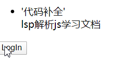
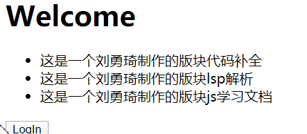

# HTML

# CSS 

## 基础操作

### 居中与垂直居中：

**行内或类行内元素：**

text-align:center

**块级元素：**

margin :auto

**通用方法：父元素操作**

display:flex justify-content:center


# JS
## JS模块化
### commonjs
:Node.js是commonJS规范的主要实践者，它有四个重要的环境变量为模块化的实现提供支持：**module、exports、require、global**。实际使用时，用module.exports定义当前模块对外输出的接口（不推荐直接用exports），用require加载模块。
### AMD&require.js
AMD规范采用异步方式加载模块，模块的加载不影响它后面语句的运行。所有依赖这个模块的语句，都定义在一个回调函数中，等到加载完成之后，这个回调函数才会运行。这里介绍用require.js实现AMD规范的模块化：**用require.config()指定引用路径等，用define()定义模块，用require()加载模块**。
　　首先我们需要引入require.js文件和一个入口文件main.js。main.js中配置require.config()并规定项目中用到的基础模块。
```javascript
script src="js/require.js" data-main="js/main"></script>
 
/** main.js 入口文件/主模块 **/
//首先用config()指定各模块路径和引用名
require.config({
    baseUrl: "js/lib",
    paths: {
        "jquery": "jquery.min",  //实际路径为js/lib/jquery.min.js
        "underscore": "underscore.min",
    }
});
//执行基本操作
require(["jquery","underscore"],function($,_){
    // some code here
});
```

### CMD 

CMD是另一种js模块化方案，它与AMD很类似，不同点在于：AMD 推崇依赖前置、提前执行，CMD推崇依赖就近、延迟执行。此规范其实是在sea.js推广过程中产生的。

```javascript
/** AMD写法 **/
define(["a", "b", "c", "d", "e", "f"], function(a, b, c, d, e, f) {
     // 等于在最前面声明并初始化了要用到的所有模块
    a.doSomething();
    if (false) {
        // 即便没用到某个模块 b，但 b 还是提前执行了
        b.doSomething()
    }
});
 
/** CMD写法 **/
define(function(require, exports, module) {
    var a = require('./a'); //在需要时申明
    a.doSomething();
    if (false) {
        var b = require('./b');
        b.doSomething();
    }
});
 
/** sea.js **/
// 定义模块 math.js
define(function(require, exports, module) {
    var $ = require('jquery.js');
    var add = function(a,b){
        return a+b;
    }
    exports.add = add;
});
// 加载模块
seajs.use(['math.js'], function(math){
    var sum = math.add(1+2);
});
```


### ES6

```javascript
/** 定义模块 math.js **/
var basicNum = 0;
var add = function (a, b) {
    return a + b;
};
export { basicNum, add };
 
/** 引用模块 **/
import { basicNum, add } from './math';
function test(ele) {
    ele.textContent = add(99 + basicNum);
}

/* export default*/
export default { basicNum, add };
//引入
import math from './math';
function test(ele) {
    ele.textContent = math.add(99 + math.basicNum);
}
```

# NodeJS

# 计算机网络

# React

### style

style 应该是预先写好的 而不是字符串

Error: The `style` prop expects a mapping from style properties to values, not a string. For example, style={{marginRight: spacing + 'em'}} when using JSX.    in h1 (at src/index.js:22)    in div (at src/index.js:21)

```jsx
let classStr = ['abc','redBg'];//abc,redBg
```

正确的做法：使用join拼接:

```jsx
<h1  className={classStr.join(" ")} > Style </h1>//abc redBg
```

添加背景：

```jsx
let exampleStyle = {
  background:"skyblue",
  borderBottom:"1px solid red",
  //由于有-只能圈起来
  'background-image':"url(https://www.baidu.com/s?wd=2020%e5%b9%b4%e5%85%a8%e5%9b%bd%e4%b8%a4%e4%bc%9a&sa=ire_dl_gh_logo&rsv_dl=igh_logo_pc)"
}
//也可以这样并起来
  backgroundImage:"url(https://www.baidu.com/img/pc_cc75653cd975aea6d4ba1f59b3697455.png)",
```

## 基础

### 函数式组件

```jsx
function Childcom(){
  let title = <h2> subTitle </h2>
  return(
      <div>
        <h1> Hello world</h1>
        {title}
      </div>
  )
}


ReactDOM.render(
  <Childcom></Childcom>,
  document.getElementById('root')
);

```

### 状态：(React State)

相当于vue Data

下面老看一个时钟

```jsx
class Clock extends React.Component{
  //
  constructor(props){
    //这样之后才可以用this.props
    super(props);
    //状态(data)--->view

  }
  render(){
    //应该放在渲染函数里面进行渲染
    this.state = {
      time:new Date().toLocaleTimeString()
    }
    // console.log(this.state.time);
    return(
    <div>
      <h1> {this.state.time} </h1>
    </div>
    )
  }
}
```

注意：

```jsx
//如果反复进行一个组件的初始化，他是不会反复重建的
setInterval(()=>{ReactDOM.render(
  <Clock></Clock>,
  document.getElementById('root')
  )
  console.log(new Date())
}
,
1000);
```

### 使用生命周期函数对组件进行操作

```jsx
class Clock extends React.Component{
  //
  constructor(props){
    //这样之后才可以用this.props
    super(props);
    //状态(data)--->view
    this.state = {
      time:new Date().toLocaleTimeString()
    }
  }
  render(){
    //这会导致组件的耦合度很高

    // console.log(this.state.time);
    return(
    <div>
      <h1> {this.state.time} </h1>
    </div>
    )
  }
  //生命周期函数 渲染完成：
  componentDidMount(){
    setInterval(()=>{
      this.state.time = new Date().toLocaleString();
    },1000);
  }
}
```

但是上面的操作是不推荐的，

我们应该使用setState来进行局部的dom更新:

```jsx


  //生命周期函数 渲染完成：
  componentDidMount(){
    setInterval(()=>{
      console.log(this.state.time);
      //修改完之后并不会立即修改dom内容。
      //react会在这个函数内部所有设置的状态
      //等待内部所有完成之后进行更新
      //小程序也是借鉴react状态管理操作
      this.setState({
        time:new Date().toLocaleString()
      })
      console.log(this.state.time);
    },1000);
  }
```

### 父子数据传递

props 可以设置默认值：

HelloMessage.defaultProps = { name : 'yqLiu' msg:'helloworld' }


props可以传递函数，props传递父元素的函数，就可以去修改父元素的状态state,从而达到传递数据给父元素的效果。

#### props机制（父->子)

props的传值可以是任意的类型

注意props和State是两个不同的东西

```jsx
class ChildComponent extends React.Component {
  constructor(props) {
    super(props);
  }
  render() {
    return (
      <div display={this.props.isActive?'block':'None'}> 
        ChildComponent
      </div>
    )
  }
}
```

#### 子传父

调用父元素的函数，从而实现数据的子传递父

```jsx
export default class ChildComponent extends Component {
  constructor(props) {
    super(props)
  
    this.state = {
       msg:'hi father'
    }
  }
  
  render() {
    return (
      <div>
        <button onClick={this.sendData}>传给父元素</button>
      </div>
    )
  }
  //使用箭头函数可以防止循环溢出
  sendData=()=>{
    this.props.getChildMsg(this.state.msg)
  }
}
```

注意不能直接使用传递过来的参数

```jsx
        {/* 注意 直接进行调用可能会导致循环渲染 */}
        <button onClick={this.props.getChildMsg('hello father')}>传给父元素</button>
```

使用箭头函数进行传参

```jsx
        {/* 要使用箭头函数进行传参 */}
        <button onClick={()=>this.props.getChildMsg('hello father')}>传给父元素</button>
```

### React事件

React 事件特点;

- 他绑定属性的命名是使用的驼峰命名法
- 如果采用jsx语法，用{}，传入一个函数，而不是字符串

事件对象：

```jsx
  parentEvent= (e)=>{
    console.log(e);
    //react的代理的原生事件对象
  }
```

普通的html中阻止默认行为 可以直接return false;

React中，必须prevetDefault

```jsx
  parentEvent= (e)=>{
    //react的代理的原生事件对象
    console.log(e.preventDefault);

    //由于是代理 所以不能直接returnfalse 不能拦截
    //使用preventDefault进行拦截
    e.preventDefault();
    return false;
  }
```

如何传参的时候不丢失事件？

```jsx
{/* 这样就变成了一个调用,使用箭头函数 使用e进行传参 */}
<button onClick={(e)=>this.parentEvent1('helloworld',e)}>submit</button>

  parentEvent1= (msg,e)=>{
    //react的代理的原生事件对象
    console.log(msg)
    console.log(e)
  }
```

注意不使用箭头函数会导致this的问题

```jsx
        {/* 不使用箭头函数要使用bind */}
        <button onClick={function(e){this.parentEvent1('helloworld',e)}.bind(this)}>submit</button>
```

### React条件渲染

- 直接通过条件判断返回需要渲染的jsx对象

判断是否登录：

```jsx
function UserGreet(props){
  return (<h1>Welcome</h1>);
}
function UserLogin(props){
  return (<h1>请先登录</h1>)
}

render() {
    if(this.state.isLogin){
      return (<UserGreet/>);
    }else{
      return (<UserLogin/>)
    }
```

注意 函数的引入必须使用component样式，不能直接return UserLogin- 

- 通过条件运算得出jsx对象，再将jsx对象渲染到模板中

```jsx
  render() {
    let ele = null;
    if(this.state.isLogin){
      ele =<UserGreet/>;
    }else{
      ele = <UserLogin/>
    }
    return (
      <div>
        <h1>yqLiu's Home</h1>
        {ele}
        <button onClick={()=>this.setState({isLogin:!this.state.isLogin})}>LogIn</button>
      </div>
    )
  
```

- 同样的，你也可以使用三元运算符：

```jsx
      <div>
        <h1>yqLiu's Home</h1>
        {this.state.isLogin?<UserGreet/>:<UserLogin/>}
        <button onClick={()=>this.setState({isLogin:!this.state.isLogin})}>LogIn</button>
      </div>
```

#### 列表渲染

将列表的内容拼装成数组 放置到模板当中

如果直接使用：

  ```jsx
let arr = ['代码补全','lsp解析','js学习文档'];    
{arr}
  ```

会输出

```jsx
代码补全lsp解析js学习文档
```

如果我们使用html对象

```jsx
let arr = [<li>'代码补全'</li>,'lsp解析','js学习文档'];
```




可以使用map:

```jsx
    {arr.map((e)=>{return <YqLiuComponent childData={e}></YqLiuComponent>})}
```

效果：

